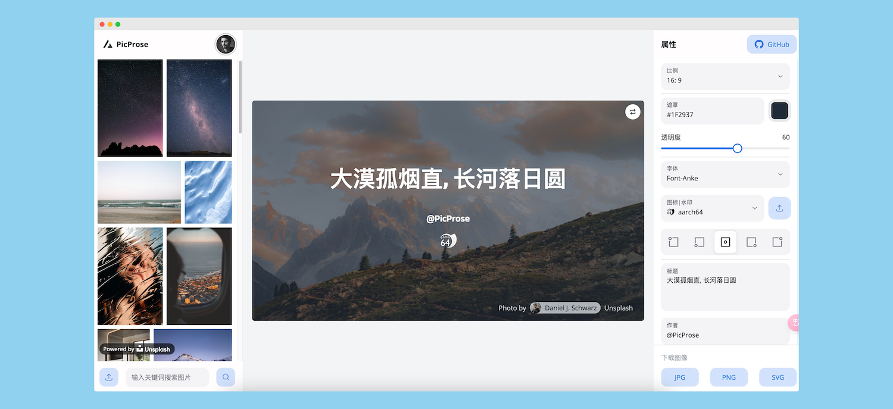

<h1 align="center">PicProse</h1>

<p align="center">
   <a href="https://github.com/gezhaoyou/picprose/stargazers"></a>
    <a href="https://github.com/gezhaoyou/picprose/releases/latest"></a>
      <a href="#"></a>
    <a href="https://github.com/gezhaoyou/picprose/blob/main/LICENSE"></a>  
</p>

## Intro
PicProse is a article cover image generator tool for Medium, Wordpress, Wechat and other blog post

**Preview:** 

[https://picprose.net](https://picprose.net)

[https://picprose.pixpark.net/](https://picprose.pixpark.net/)(Chinese mainland)

**Showcase:**

[https://pixpark.net](https://pixpark.net)



## Getting Started

**Step 1:**

config Unsplash key

💡 create file `.env.local`, put in your unsplash key 
```
NEXT_PUBLIC_UNSPLASH_API_KEY = your_unsplash_api_key
```
Refer: [https://unsplash.com/documentation](https://unsplash.com/documentation)


**Step 2:**

Run the development server:

```bash
npm install
npm run dev
# or
yarn install
yarn dev
```

Open [http://localhost:3000](http://localhost:3000) with your browser to see the result.

You can start editing the page by modifying `app/page.tsx`. The page auto-updates as you edit the file.

This project uses [`next/font`](https://nextjs.org/docs/basic-features/font-optimization) to automatically optimize and load Inter, a custom Google Font.

## Deploy Static

Run
 ```bash
npm run build
 ```
static file generate to `out` dir

## Deploy to Vercel
You can start by creating your own Nextra site and deploying to Vercel by clicking the link:

<a className="mt-3 inline-flex"
  target="_blank"
  href="https://vercel.com/new/clone?s=https://github.com/gezhaoyou/picprose&showOptionalTeamCreation=false"></a>

## Deploy with Docker

```sh
docker run -d --name picprose -e NEXT_PUBLIC_UNSPLASH_API_KEY=xxx -p 3000:3000 hausen1012/picprose
```

## License
PicProse is open-source under the [MIT License](https://github.com/gezhaoyou/picprose/blob/main/LICENSE).
